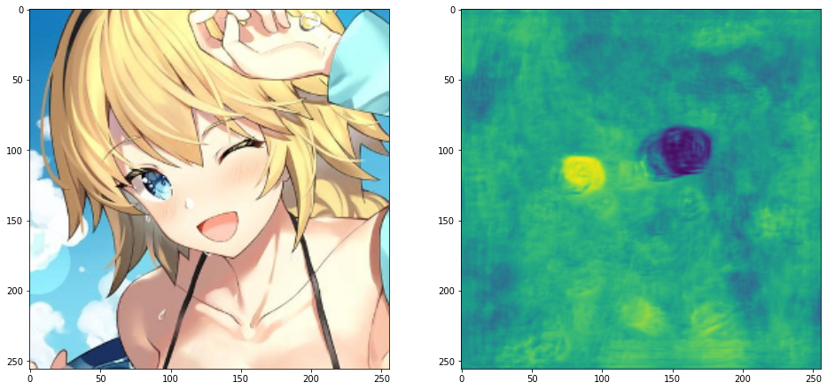
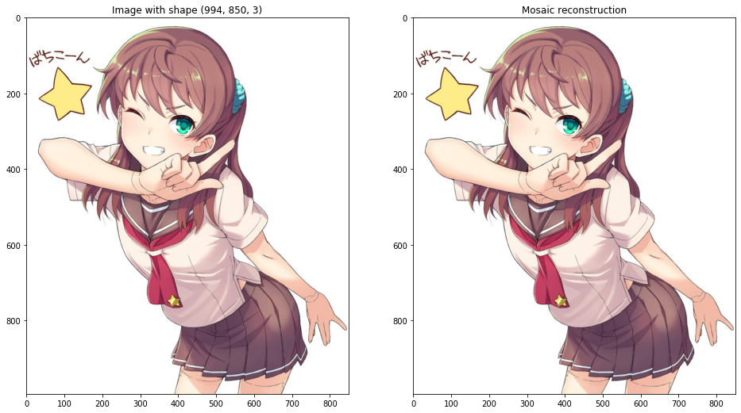
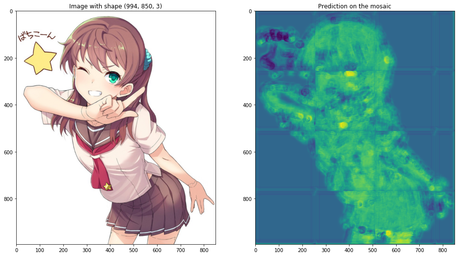
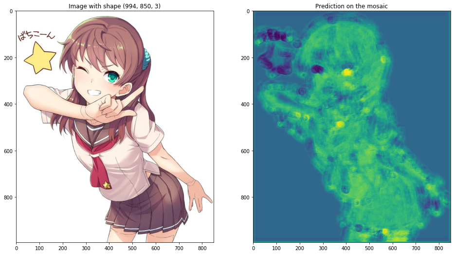
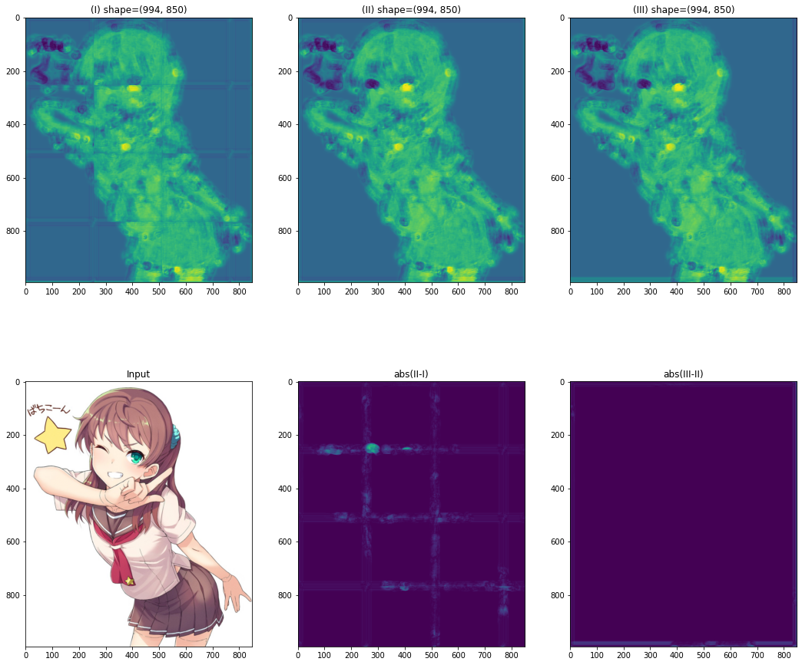

# MightyMosaic

- [Introduction](#introduction)
- [Requirements](#requirements)
- [How to Use](#how-to-use)
    - [Open the images](#open-the-images)
    - [Create a basic mosaic](#create-a-basic-mosaic)
    - [Create an overlapping mosaic](#create-an-overlapping-mosaic)
    - [About the *fill\_mode* parameter](#about-the-fill_mode-parameter)
    

## Introduction

The goal of the library is to create a "mosaic", which is a sublass of np.ndarray, dividing images of arbitrary shape into a 4d or 5d array. 
The class is implemented so that we can apply functions on the tiles (usually the prediction function of a neural network, which has a fixed input shape) and fuse the result.

The MightyMosaic allow the overlapping of tiles, which is necessary to avoid discrepancies between adjacent tiles.


## Requirements

As we use f-string (in the asserts) it is necessary to have, at least, **python3.6**.

- numpy
- tqdm

For running this jupyter notebook (which should have been converted to markdown at some point), we also need the following library:
- matplotlib
- pillow
- keras


## How to use

Let's begin by importing the library that we need and define the filename for both the images and the model that we will use.

Btw, credits for itout (#pixiv69581) and Akae Neo (#17014316) for drawing the pictures that we used as examples.


```python
import os 

import matplotlib.pyplot as plt
import numpy as np
import PIL.Image

from keras.models import load_model

import MightyMosaic
```


```python
face_filename = "3578641 0.png"
full_filename = "__original_drawn_by_itou_onsoku_tassha__sample-f9c6557ccec993c08627d33e49cf4524.jpg"
model_filename = "open_eyes_saliency_256.h5"
```


```python
model = load_model(model_filename)
print(f"The model input shape is {model.input_shape}")
```

    The model input shape is (None, 256, 256, 3)
    

### Open the images

The opening of the images can be done directly using PIL and numpy.

First, we show that our model can process a picture of shape (256, 256, 3) (more accurately, a batch of shape (?, 256, 256, 3)).


```python
face_im = np.array(PIL.Image.open(face_filename))/255
full_im = np.array(PIL.Image.open(full_filename))/255

prediction = model.predict(np.expand_dims(face_im, axis=0))[0,:,:,0]
```


```python
plt.figure(figsize=(16, 8))
plt.subplot(121)
plt.imshow(face_im, interpolation='bilinear', vmin=0, vmax=1)
plt.subplot(122)
plt.imshow(prediction, interpolation='bilinear', vmin=0, vmax=1)
plt.show()
```





Nice, right? The model return a value of 0 on closed eyes, and 1 on opened eyes.

### Create a basic mosaic

However, if we want to run the model on picture of different shape, we need either to resize the picture, which is, obviously, non-ideal, are to divide it in patch and run the network on each of them.

We will start by creating the mosaic, applying the model can be done later.

It is done by calling the method *MightyMosaic.from\_array*. The basic usage is to provide only two parameters : the image that we want to transform, and the size of each tiles (here (256,256)).
Please note that it is not mandatory to have square tiles, it's just how our network was constructed.

After constructing the mosaic, we will try to retrieve the original image. This is done with the *get\_fusion* method.


```python
mosaic_without_overlap = MightyMosaic.from_array(full_im, (256,256), overlap_factor=1)
print(f'The mosaic shape is {mosaic_without_overlap.shape}')

plt.figure(figsize=(16, 16))
plt.subplot(121)
plt.title(f'Image with shape {full_im.shape}')
plt.imshow(full_im, interpolation='bilinear', vmin=0, vmax=1)

plt.subplot(122)
plt.title('Mosaic reconstruction')
plt.imshow(mosaic_without_overlap.get_fusion(), interpolation='bilinear', vmin=0, vmax=1)
plt.show()
```

    The mosaic shape is (4, 4, 256, 256, 3)
    





If the two images are different, that's mean that I commit something, broke another, and didn't check the results. Hopefully, that didn't happen.

Let's apply the *predict* method and check the result.
Please notice that we use a lambda, because the model outputs a (?, 256, 256, 1)-shaped array.

We can have a *progress\_bar* to see the progress of the prediction. 


```python
fused_prediction_without_overlap = mosaic_without_overlap.apply(lambda x: model.predict(x)[:,:,:,0], progress_bar=True)
fused_prediction_without_overlap = fused_prediction_without_overlap.get_fusion()

plt.figure(figsize=(16, 16))
plt.subplot(121)
plt.title(f'Image with shape {full_im.shape}')
plt.imshow(full_im, interpolation='bilinear', vmin=0, vmax=1)

plt.subplot(122)
plt.title('Prediction on the mosaic')
plt.imshow(fused_prediction_without_overlap, interpolation='bilinear', vmin=0, vmax=1)
plt.show()
```


    HBox(children=(IntProgress(value=0, max=16), HTML(value='')))


    
    





Meh. Not convinced about the results? Maybe it's because of the boundary of each tile, clearly visible in the prediction. And since the left eye is between four tiles, the prediction can't be accurate.

### Create an overlapping mosaic

In fact, what we want is an overlapping mosaic (meaning that the tiles overlap). And that's what MightyMosaic is for.

Let's create a mosaic with an *overlapping\_factor* of 2, meaning that the stride, between each tile is only *tile\_shape*/2.
Of course, an overlapping_factor of one means no overlapping, and you can increase the factor to any positive integer. However, please note that the number of tile increase with *tile\_shape*^2, so might want to refrain to use a high *overlapping\_factor* (it would be quite useless anyway).

Also, do not use a *overlap\_factor* that can't divide the *tile\_shape* (that also means that you want to avoid odd shapes).


```python
mosaic = MightyMosaic.from_array(full_im, (256,256), overlap_factor=2)
print(f'The mosaic shape is {mosaic.shape}')
```

    The mosaic shape is (8, 8, 256, 256, 3)
    

The number of tiles is not of 16 anymore, but raises to 64.

Our prediction support batchs, so we will use it to speed up the processing a little: we add a parameter *batch\_size* with 8 as a value.


```python
prediction = mosaic.apply(lambda x: model.predict(x)[:,:,:,0], progress_bar=True, batch_size=8)
prediction = prediction.get_fusion()

plt.figure(figsize=(16, 16))
plt.subplot(121)
plt.title(f'Image with shape {full_im.shape}')
plt.imshow(full_im, interpolation='bilinear', vmin=0, vmax=1)

plt.subplot(122)
plt.title('Prediction on the mosaic')
plt.imshow(prediction, interpolation='bilinear', vmin=0, vmax=1)
plt.show()
```


    HBox(children=(IntProgress(value=0, max=8), HTML(value='')))


    
    





The prediction is quite better, without visible borders between tiles.

### About the *fill\_mode* parameter

Copying the keras *fill\_mode* parameter, we enable to change the way the mosaic is filled.
The possible values are *constant*, *nearest* and *reflect*. Please refer to the [documentation of keras](https://keras.io/preprocessing/image/) for more details.

Here, we create a mosaic with "*reflect*" as the *fill\_mode*.


```python
mosaic_with_reflection = MightyMosaic.from_array(full_im, (256,256), overlap_factor=4, fill_mode='reflect')
print(f'The mosaic shape is {mosaic_with_reflection.shape}')
```

    The mosaic shape is (16, 16, 256, 256, 3)
    

OK, we now are ready to plot, side by side, the prediction for:
- the mosaic without overlap (I);
- the mosaic with an *overlapping\_factor* of 2 (II);
- the mosaic with an *overlapping\_factor* of 4 and a *fill\_mode* at "*nearest*" (III).

We also plot abs(II-I) and abs(III-II) to highlight the effects of the parameters.


```python
prediction_with_reflection = mosaic_with_reflection.apply(lambda x: model.predict(x)[:,:,:,0], 
                                                          progress_bar=True, batch_size=8)
prediction_with_reflection = prediction_with_reflection.get_fusion()

plt.figure(figsize=(18, 16))
plt.subplot(234)
plt.title('Input')
plt.imshow(full_im, interpolation='bilinear', vmin=0, vmax=1)
plt.subplot(231)
plt.title(f'(I) shape={fused_prediction_without_overlap.shape}')
plt.imshow(fused_prediction_without_overlap, interpolation='bilinear', vmin=0, vmax=1)
plt.subplot(232)
plt.title(f'(II) shape={prediction.shape}')
plt.imshow(prediction, interpolation='bilinear', vmin=0, vmax=1)
plt.subplot(233)
plt.title(f'(III) shape={prediction_with_reflection.shape}')
plt.imshow(prediction_with_reflection, interpolation='bilinear', vmin=0, vmax=1)
plt.subplot(235)
plt.title('abs(II-I)')
plt.imshow(abs(fused_prediction_without_overlap-prediction), interpolation='bilinear', vmin=0, vmax=1)
plt.subplot(236)
plt.title('abs(III-II)')
plt.imshow(abs(prediction-prediction_with_reflection), interpolation='bilinear', vmin=0, vmax=1)
plt.show()
```


    HBox(children=(IntProgress(value=0, max=32), HTML(value='')))


    
    





That's it.


```python

```
